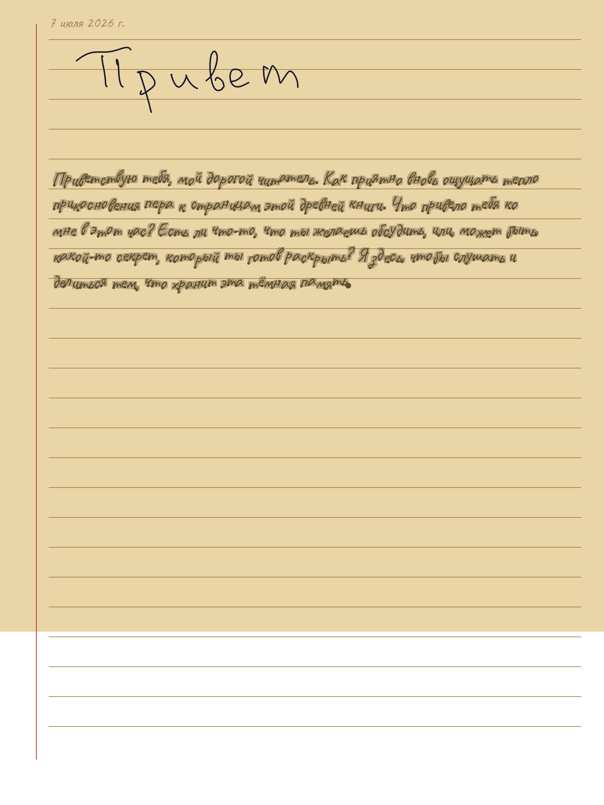

# Riddle Diary 🪶

A handwriting chat in the style of **Tom Riddle's diary**, built for the
**BOOX Note Air5 C** e-ink tablet.

Write on the page with the stylus → after a short pause your handwriting is
recognized on-device → an LLM replies → the reply **draws itself** onto the page
glyph-by-glyph, as if ink were appearing on its own. The conversation accumulates
down a single continuous notebook.




## Features

- **Onyx-like writing** — real-time, Bezier-smoothed stylus ink (EMR).
- **Auto-send on pause** — no buttons; ~1.4 s after you stop writing it recognizes
  and replies.
- **On-device OCR** — ML Kit Digital Ink (Russian) converts your handwriting to text.
- **Streaming LLM** — OpenAI-compatible (default OpenRouter); the "Tom Riddle" voice
  replies.
- **Self-drawing replies** — the answer writes itself on the page glyph-by-glyph with
  wet-ink spread and occasional drips.
- **Old-planner pages** — aged-paper background, ruled lines, red margin, date header,
  page-break gutters; fullscreen immersive.
- **Persistent** — the whole diary (your strokes + replies + history) survives restart
  (JSON in app internal storage).

## Target device

- BOOX Note Air5 C — 10.3" Kaleido 3 **color** e-ink, **Android 15 (API 35)**,
  EMR stylus (Wacom-type, pressure + tilt, battery-less).
- Standard Android stylus APIs — no proprietary SDK required.

## The loop

```
stylus ──► DrawSurface (ink) ──pause──► ML Kit Digital Ink OCR (ru, on-device)
        ──► OpenRouter LLM (streaming) ──► HandwritingSynthesizer (font→paths)
        ──► HandwritingRenderer (animated "ink appears") ──► page
```

- **Stylus draws, finger scrolls** (stylus events captured before the scroll
  gesture).
- **Auto-send** on a ~1.4 s writing pause — no "send" button.
- **Russian handwriting** recognition via ML Kit Digital Ink (`ru` model
  downloads on first run; device needs WiFi).
- **Streaming** LLM responses (OpenAI-compatible; default OpenRouter).
- **Self-drawing** reply: the synthesized glyph paths animate via
  `android.graphics.PathMeasure` at an e-ink-friendly cadence.

## Build

The project builds inside Docker so no host Android SDK is needed.

```bash
# build the builder image once
docker build -t riddle-builder .

# build the debug APK
docker run --rm --user $(id -u):$(id -g) -v "$PWD":/workspace -w /workspace \
  -e GRADLE_USER_HOME=/workspace/.gradle-home -e HOME=/tmp \
  riddle-builder ./gradlew :app:assembleDebug
```

APK: `app/build/outputs/apk/debug/app-debug.apk`

## Configure the LLM

Create `app/src/main/java/com/scribble/riddle/llm/Secrets.kt` (gitignored):

```kotlin
package com.scribble.riddle.llm

object Secrets {
    const val OPENROUTER_API_KEY = "sk-or-..."
}
```

Endpoint and model live in `Config.kt` (default:
`https://openrouter.ai/api/v1`, `openai/gpt-4o-mini`).

## Deploy to the BOOX

From WSL2 (Windows host), with the device connected over USB:

```bash
# 1) On Windows (PowerShell, admin): attach the device to WSL2 via usbipd-win
usbipd bind --busid <busid>
usbipd attach --wsl --busid <busid>

# 2) In WSL2: adb (install once: download platform-tools, or use Windows adb.exe)
adb install -r app/build/outputs/apk/debug/app-debug.apk
adb shell pm enable com.scribble.riddle        # BOOX quirk: sideloaded apps start disabled
adb shell am start -n com.scribble.riddle/.MainActivity
```

> BOOX quirk: the very first launch right after `install` can crash; a second
> `am start` (or launching from the app icon) runs fine.

## Project layout

```
app/src/main/java/com/scribble/riddle/
  MainActivity.kt            # entry; loads font, hosts DiaryScreen
  ui/DiaryScreen.kt          # the page: stylus capture, pause→OCR→LLM→render, scroll
  ui/HandwritingRenderer.kt  # DrawScope.renderAnimated: PathMeasure glyph animation
  ui/InkPathFactory.kt       # text → glyph paths (bundled handwriting font)
  ui/DrawSurface.kt          # stroke / response-group data models
  ocr/InkRecognizer.kt       # ML Kit Digital Ink wrapper (Russian)
  llm/LlmProvider.kt         # OpenAI-compatible streaming chat (SSE)
  llm/Config.kt              # endpoint / model / system prompt (the diary "voice")
  llm/Secrets.kt             # API key (gitignored — create your own)
docs/superpowers/specs/      # full design spec
docs/superpowers/plans/      # implementation plan (Phase 1 tracer bullet)
```

## Tech

Kotlin · Jetpack Compose · ML Kit Digital Ink · OkHttp (SSE) ·
kotlinx-serialization · Gradle Kotlin DSL · Docker build env
(Temurin 21 + Android SDK 35).

## Status & next steps

Working end-to-end on the BOOX Note Air5 C: write → OCR → LLM → self-drawn reply,
paged old-planner look, fullscreen, and the diary persists across restart.

Possible next steps: a true single-stroke Cyrillic font (current reply uses a filled
handwriting font — single-stroke Hershey/Cyrillic is a known rabbit hole, see
`docs/`); history windowing + summarization for long conversations; per-conversation
personas / settings screen.

See `docs/superpowers/specs/2026-07-05-riddle-diary-design.md` for the complete
design and `docs/superpowers/plans/` for the implementation plan.

## License

Code: **MIT** — see [LICENSE](LICENSE).
The bundled **Caveat** handwriting font is under the SIL Open Font License 1.1
(`app/src/main/res/raw/caveat_ofl.txt`), separate from the MIT license.
ML Kit, Compose, OkHttp, etc. retain their respective licenses.
